# MediFlow AI — AI-Powered Hospital Workflow Orchestration Platform

<div align="center">

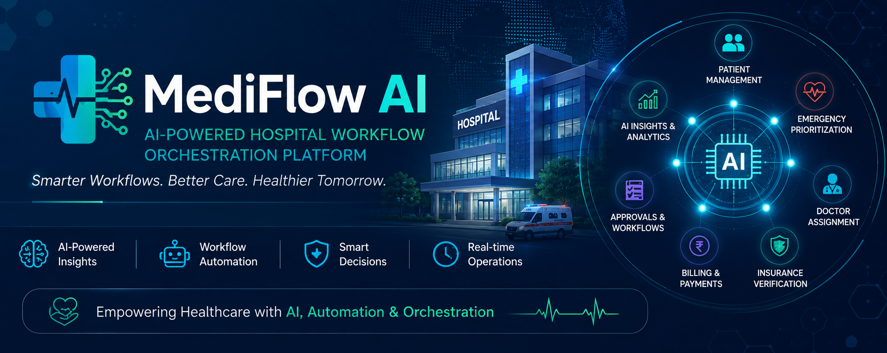

<br/>

[](https://nodejs.org/)
[](https://reactjs.org/)
[](https://mongodb.com/)
[](https://tailwindcss.com/)
[](https://expressjs.com/)
[](https://uipath.com/)

<br/>

> **🏆 Submitted for UiPath AgentHack | Team: Neural Nexus**

</div>

---

## 📌 Table of Contents

- [Overview](#-overview)
- [Problem Statement](#-problem-statement)
- [Key Features](#-key-features)
- [System Architecture](#-system-architecture)
- [Technology Stack](#-technology-stack)
- [Project Structure](#-project-structure)
- [Screenshots](#-screenshots)
- [Installation & Setup](#-installation--setup)
- [Environment Variables](#-environment-variables)
- [Future Enhancements](#-future-enhancements)
- [Team](#-team)
- [License](#-license)

---

## 🔍 Overview

**MediFlow AI** is an intelligent, full-stack hospital workflow management platform that combines **Artificial Intelligence**, **Workflow Automation**, and **Healthcare Operations Management** into a single unified system.

Healthcare organizations face critical operational challenges every day — from delayed emergency responses to fragmented billing systems. MediFlow AI bridges these gaps by integrating AI-powered decision-making with BPMN-based workflow orchestration and real-time hospital analytics, enabling hospitals to operate faster, smarter, and more efficiently.

---

## 🎯 Problem Statement

Modern healthcare operations suffer from:

| Challenge | Impact |
|-----------|--------|
| Manual patient prioritization | Delayed treatment for critical cases |
| Inefficient doctor allocation | Overburdened staff and poor patient care |
| Insurance verification delays | Revenue loss and billing backlogs |
| Fragmented workflow management | Operational inefficiency across departments |
| Lack of real-time insights | Poor decision-making and resource planning |

**MediFlow AI** solves these challenges through AI-driven automation, intelligent prioritization, and real-time operational visibility.

---

## ✨ Key Features

<details>
<summary><b>👨‍⚕️ Patient Management</b></summary>

- Complete Patient Registration System
- Patient Records Management
- Advanced Search and Filter Functionality
- Comprehensive Medical Information Tracking

</details>

<details>
<summary><b>🚨 Emergency Queue Management</b></summary>

- AI-based Risk Assessment
- Intelligent Patient Prioritization
- Critical Case Identification
- Real-time Emergency Queue Monitoring

</details>

<details>
<summary><b>🩺 Doctor Assignment System</b></summary>

- Specialty-based Doctor Allocation
- Automated Assignment Suggestions
- Patient Load Monitoring
- Department Management

</details>

<details>
<summary><b>🛡️ Insurance Management</b></summary>

- Insurance Verification Tracking
- Approval Management
- Pending Claims Monitoring
- Verification Analytics

</details>

<details>
<summary><b>💰 Billing System</b></summary>

- Automated Billing Dashboard
- Revenue Tracking
- Payment Status Monitoring
- Financial Insights

</details>

<details>
<summary><b>📊 Analytics Dashboard</b></summary>

- Patient Distribution Analytics
- Insurance Statistics
- Revenue Insights
- Operational KPIs
- AI Insights Panel

</details>

<details>
<summary><b>🤖 AI Features</b></summary>

- Symptom Analysis
- Risk Prediction
- Smart Recommendations
- Operational Insights
- Decision Support System

</details>

<details>
<summary><b>🔄 Workflow Automation</b></summary>

- BPMN-based Workflow Orchestration via UiPath Maestro
- Emergency Routing
- Human-in-the-Loop Approval Processes
- Automated Workflow Management

</details>

---

## 🏗 System Architecture

```
┌─────────────────────────────────────────────────┐
│              Frontend (React.js + Tailwind CSS)  │
└───────────────────────┬─────────────────────────┘
                        │
┌───────────────────────▼─────────────────────────┐
│           Backend (Node.js + Express.js)         │
└───────────────────────┬─────────────────────────┘
                        │
┌───────────────────────▼─────────────────────────┐
│                Database (MongoDB)                │
└───────────────────────┬─────────────────────────┘
                        │
┌───────────────────────▼─────────────────────────┐
│         AI Services (Groq API + Llama Model)     │
└───────────────────────┬─────────────────────────┘
                        │
┌───────────────────────▼─────────────────────────┐
│       Workflow Automation (UiPath Maestro BPMN)  │
└───────────────────────┬─────────────────────────┘
                        │
┌───────────────────────▼─────────────────────────┐
│          Hospital Operations & Analytics         │
└─────────────────────────────────────────────────┘
```


---

## 🛠 Technology Stack

| Layer | Technology |
|-------|------------|
| **Frontend** | React.js, Tailwind CSS, React Router, Axios, Recharts |
| **Backend** | Node.js, Express.js, REST APIs |
| **Database** | MongoDB, Mongoose |
| **AI & ML** | Groq API, Llama Model |
| **Workflow Automation** | UiPath Maestro BPMN |
| **Authentication** | JWT (JSON Web Tokens) |
| **Other Tools** | Nodemailer, Multer, CORS, Git & GitHub |

---

## 📂 Project Structure

```
MediFlow-AI/
│
├── backend/
│   ├── config/             # Database & environment configuration
│   ├── controllers/        # Route controllers and business logic
│   ├── models/             # Mongoose data models
│   ├── routes/             # Express API routes
│   └── server.js           # Main server entry point
│
├── frontend/
│   ├── public/             # Static assets
│   └── src/
│       ├── components/     # Reusable UI components
│       ├── pages/          # Application pages
│       ├── services/       # API service integrations
│       └── assets/         # Images and media files
│
├── Screenshots/            # Application screenshots
│
└── README.md
```

---

## 📸 Screenshots

### 🔐 Login Page
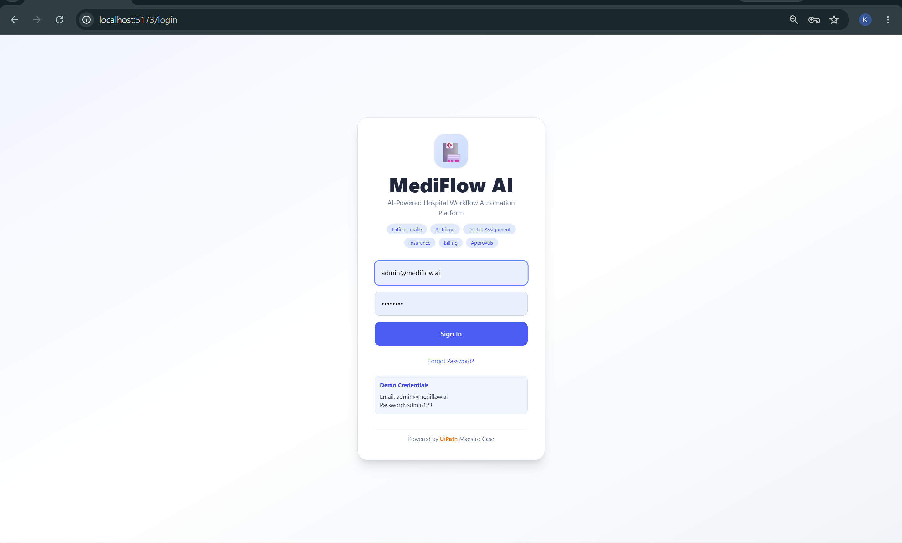

### 📊 Dashboard
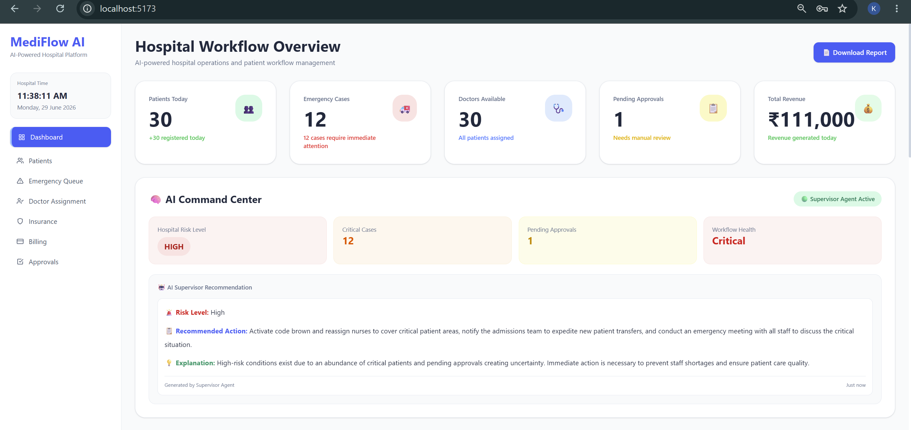
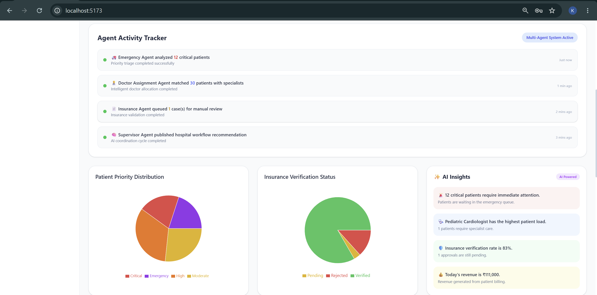
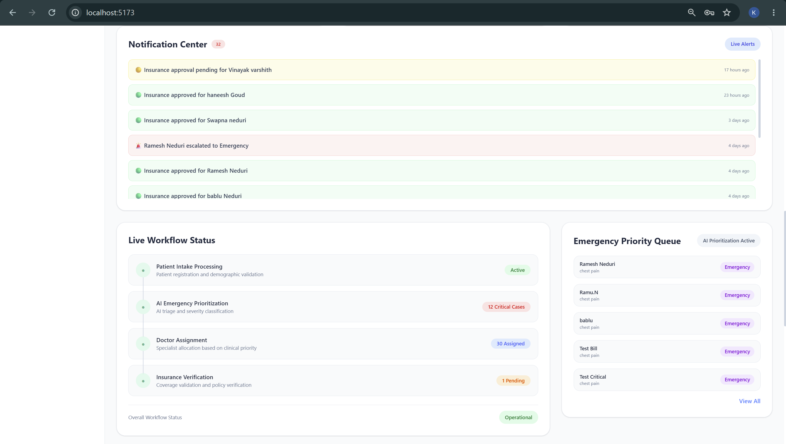
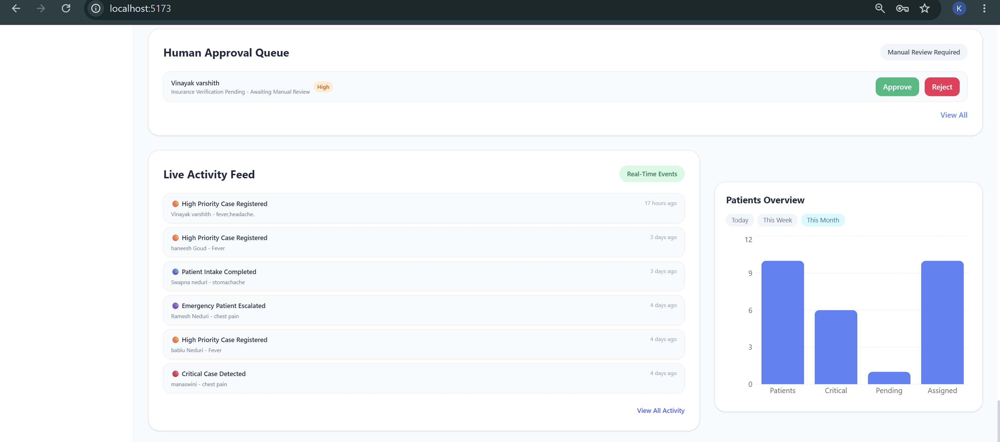
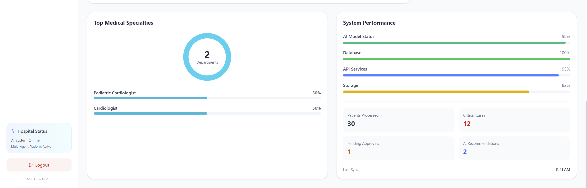

### 👨‍⚕️ Patient Management
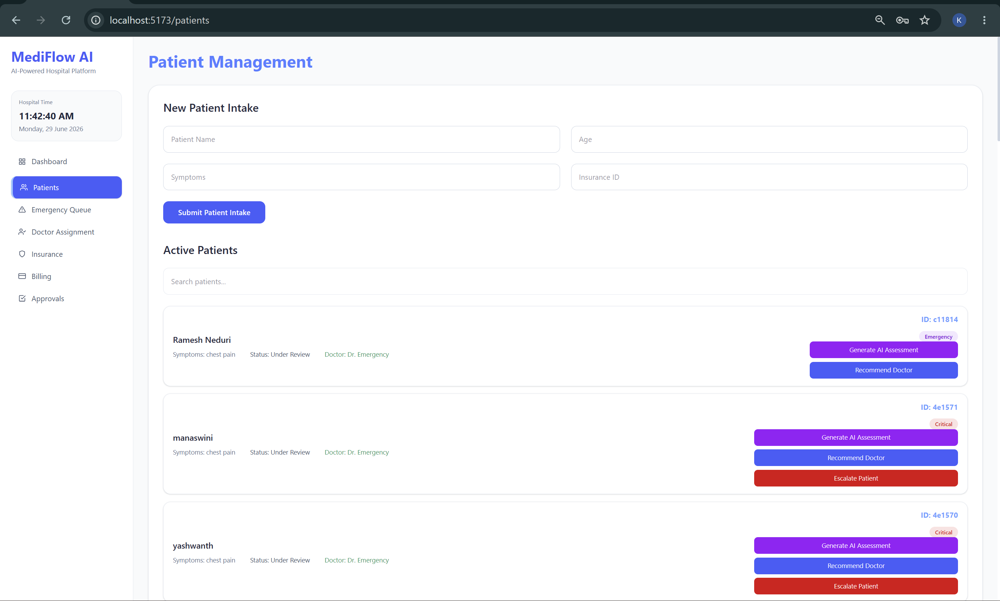

### 🚨 Emergency Queue
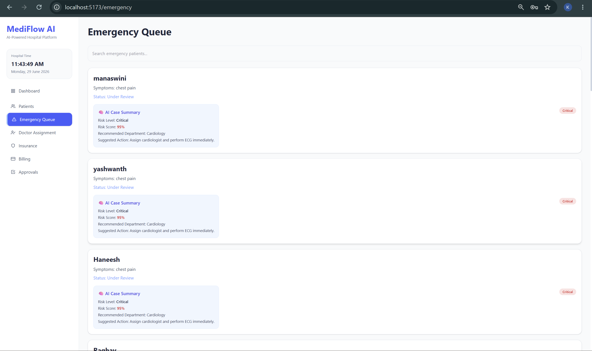

### 🩺 Doctor Assignment
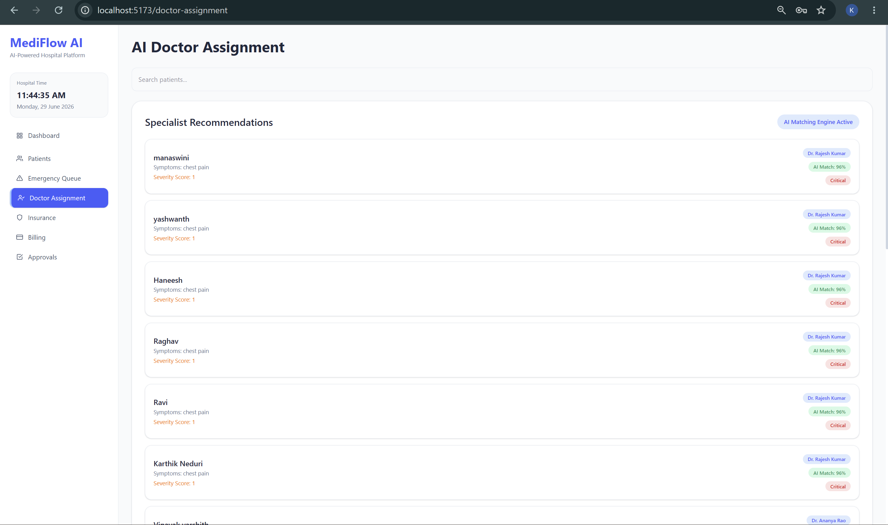

### 🛡️ Insurance Dashboard
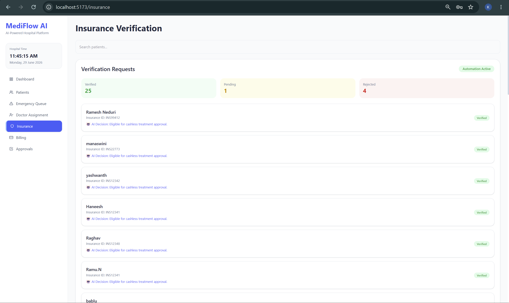

### 💰 Billing Dashboard
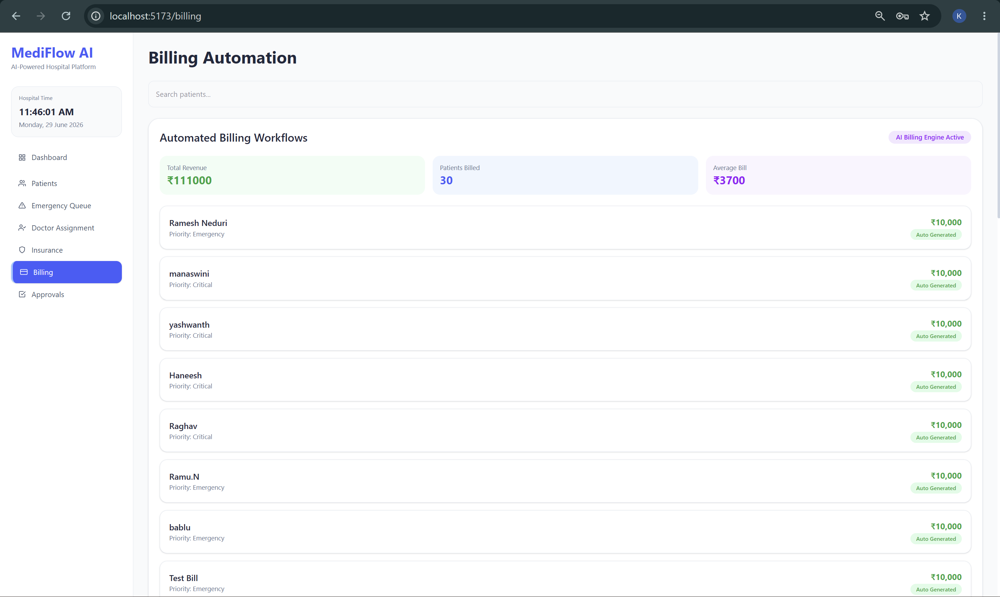

### ✅ Approvals Dashboard
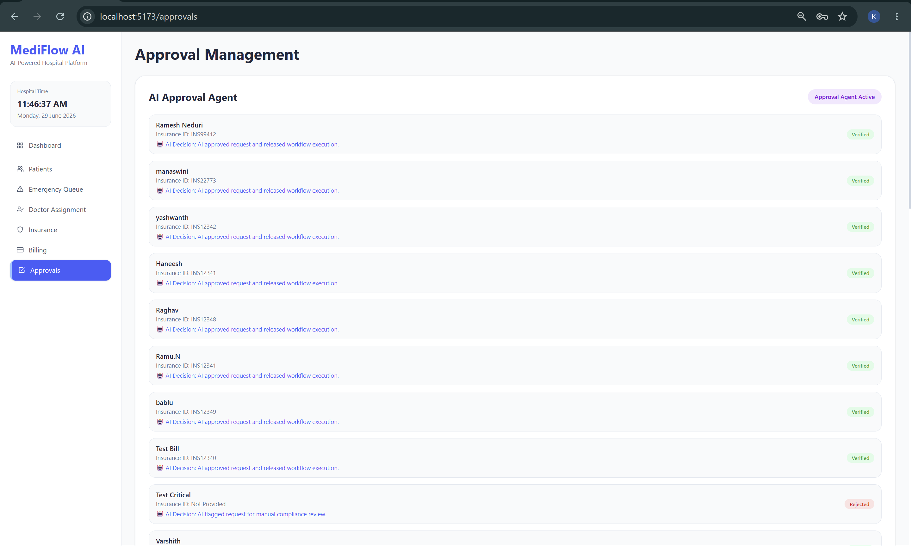

### 🔄 UiPath Maestro BPMN Workflow
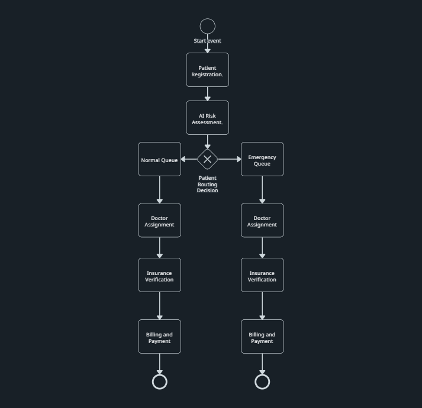

---

## ⚙️ Installation & Setup

### Prerequisites

Make sure you have the following installed:

- [Node.js](https://nodejs.org/) (v18 or above)
- [MongoDB](https://www.mongodb.com/) (local or Atlas)
- [Git](https://git-scm.com/)

---

### 1. Clone the Repository

```bash
git clone https://github.com/Karthik-0917/MediFlow-AI.git
cd MediFlow-AI
```

---

### 2. Backend Setup

```bash
cd backend
npm install
```

> Configure your `.env` file before starting the server. See [Environment Variables](#-environment-variables).

```bash
npm start
```

The backend server will start on `http://localhost:5000`

---

### 3. Frontend Setup

```bash
cd frontend
npm install
npm run dev
```

The frontend application will start on `http://localhost:5173`

---

## 🔐 Environment Variables

Create a `.env` file inside the `/backend` directory and configure the following variables:

```env
PORT=5000
MONGO_URI=YOUR_MONGODB_CONNECTION_STRING
GROQ_API_KEY=YOUR_GROQ_API_KEY
JWT_SECRET=YOUR_SECRET_KEY
```

| Variable | Description |
|----------|-------------|
| `PORT` | Port number for the backend server |
| `MONGO_URI` | MongoDB connection string (local or Atlas) |
| `GROQ_API_KEY` | API key for Groq AI service |
| `JWT_SECRET` | Secret key for JWT authentication |

> ⚠️ **Never commit your `.env` file to version control.** Add it to `.gitignore`.

---

## 🔮 Future Enhancements

- [ ] Real-time Notifications (WebSockets)
- [ ] Appointment Scheduling System
- [ ] Predictive Analytics Engine
- [ ] AI Chat Assistant
- [ ] Role-Based Access Control (RBAC)
- [ ] Cloud Deployment (AWS / Azure)
- [ ] Multi-Hospital Support
- [ ] Electronic Health Record (EHR) Integration

---

## 👥 Team

## 👥 Team

<table>
  <tr>
    <td align="center">
      <b>Karthik Neduri</b><br/>
      B.Tech Computer Science Engineering<br/>
      GITAM University, Hyderabad<br/>
      <a href="https://github.com/Karthik-0917">GitHub</a>
    </td>
    <td align="center">
      <b>Varshith Reddy</b><br/>
      B.Tech Computer Science Engineering<br/>
      GITAM University, Hyderabad<br/>
    </td>
  </tr>
</table>

**Team Name:** Neural Nexus  
**Hackathon:** UiPath AgentHack  
**Category:** AI-Powered Workflow Automation

**Team Name:** Neural Nexus  
**Hackathon:** UiPath AgentHack  
**Category:** AI-Powered Workflow Automation

---

## 📜 License

This project is developed for **educational and hackathon purposes**.  
All rights reserved © 2024 Karthik Neduri — Neural Nexus.

---

<div align="center">

**If you found this project helpful or interesting, please consider giving it a ⭐ star — it means a lot!**

[](https://github.com/Karthik-0917/MediFlow-AI/stargazers)
[](https://github.com/Karthik-0917/MediFlow-AI/network/members)

</div>
```
